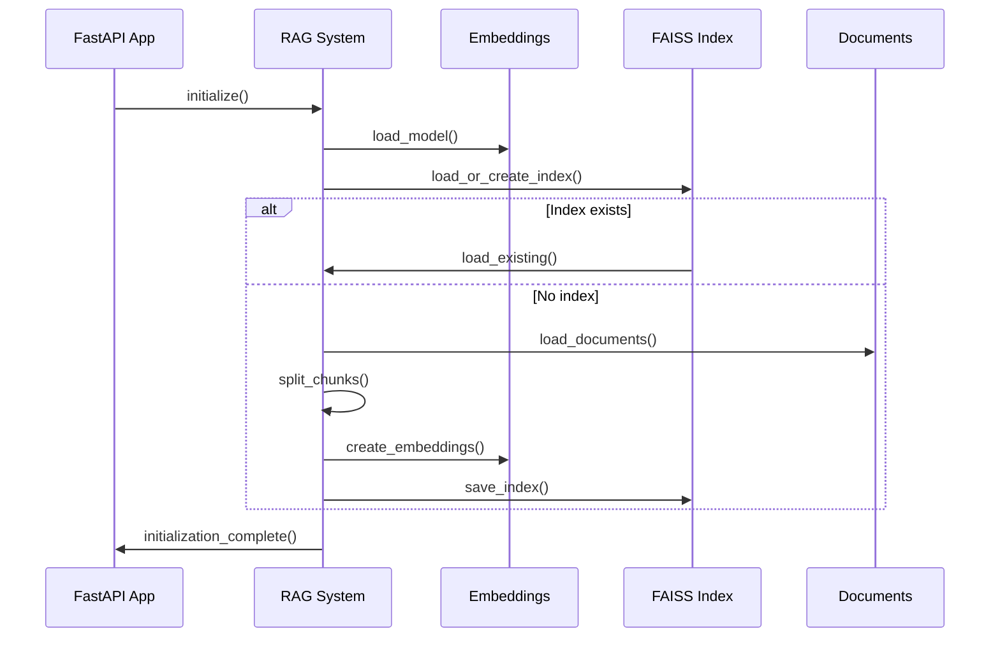
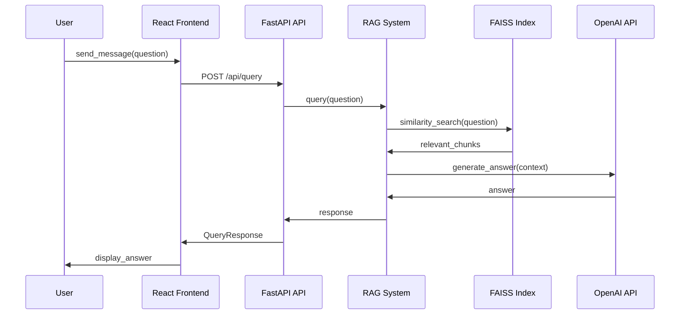
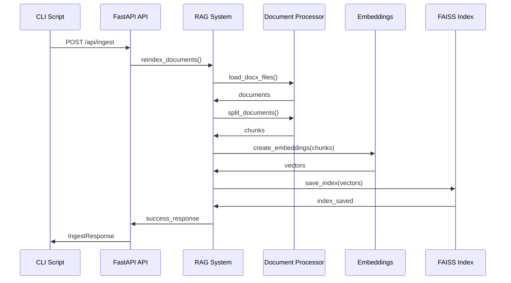

# 🏗️ Архитектура RAG Oozo System

## Обзор системы

RAG Oozo System - это полнофункциональная система Retrieval-Augmented Generation, построенная на современном технологическом стеке с четким разделением ответственности между компонентами.

## 🎯 Принципы архитектуры

### Модульность
- Каждый компонент имеет четко определенную ответственность
- Слабая связанность между модулями
- Высокая когезия внутри модулей

### Масштабируемость
- Горизонтальное масштабирование компонентов
- Асинхронная обработка
- Кэширование и оптимизация

### Безопасность
- Валидация всех входных данных
- Обработка ошибок и исключений
- Логирование для аудита

### Производительность
- Эффективные алгоритмы поиска
- Оптимизированная обработка документов
- Минимизация сетевых запросов

## 🏛️ Архитектурные слои

```
┌─────────────────────────────────────────────────────────────┐
│                    Presentation Layer                       │
│  ┌─────────────────┐  ┌─────────────────┐  ┌─────────────┐  │
│  │   React Frontend│  │   API Docs      │  │   CLI Tools │  │
│  └─────────────────┘  └─────────────────┘  └─────────────┘  │
└─────────────────────────────────────────────────────────────┘
┌─────────────────────────────────────────────────────────────┐
│                     API Layer                               │
│  ┌─────────────────┐  ┌─────────────────┐  ┌─────────────┐  │
│  │   FastAPI       │  │   CORS          │  │   Validation│  │
│  └─────────────────┘  └─────────────────┘  └─────────────┘  │
└─────────────────────────────────────────────────────────────┘
┌─────────────────────────────────────────────────────────────┘
│                   Business Logic Layer                      │
│  ┌─────────────────┐  ┌─────────────────┐  ┌─────────────┐  │
│  │   RAG System    │  │   Document      │  │   Vector    │  │
│  │                 │  │   Processor     │  │   Store     │  │
│  └─────────────────┘  └─────────────────┘  └─────────────┘  │
└─────────────────────────────────────────────────────────────┘
┌─────────────────────────────────────────────────────────────┐
│                    Data Layer                               │
│  ┌─────────────────┐  ┌─────────────────┐  ┌─────────────┐  │
│  │   FAISS Index   │  │   Documents     │  │   Metadata  │  │
│  └─────────────────┘  └─────────────────┘  └─────────────┘  │
└─────────────────────────────────────────────────────────────┘
┌─────────────────────────────────────────────────────────────┐
│                  External Services                          │
│  ┌─────────────────┐  ┌─────────────────┐  ┌─────────────┐  │
│  │   OpenAI API    │  │   HuggingFace   │  │   LangChain │  │
│  └─────────────────┘  └─────────────────┘  └─────────────┘  │
└─────────────────────────────────────────────────────────────┘
```

## 🔧 Компоненты системы

### 1. Presentation Layer

#### React Frontend
- **Назначение**: Пользовательский интерфейс
- **Технологии**: React, CSS3, JavaScript ES6+
- **Компоненты**:
  - `ChatInterface` - основной интерфейс чата
  - `MessageList` - список сообщений
  - `MessageInput` - ввод сообщений
  - `Message` - отображение сообщений

#### API Documentation
- **Назначение**: Автоматическая документация API
- **Технологии**: FastAPI, Swagger UI
- **Функции**: Интерактивная документация, тестирование API

#### CLI Tools
- **Назначение**: Управление системой из командной строки
- **Скрипты**:
  - `start.sh` - запуск системы
  - `stop.sh` - остановка системы
  - `reindex.sh` - переиндексация
  - `logs.sh` - просмотр логов

### 2. API Layer

#### FastAPI Application
- **Назначение**: Веб-фреймворк для API
- **Особенности**:
  - Асинхронная обработка запросов
  - Автоматическая валидация данных
  - Встроенная документация
  - Высокая производительность

#### CORS Middleware
- **Назначение**: Обработка кросс-доменных запросов
- **Настройки**: Разрешенные домены, методы, заголовки

#### Data Validation
- **Назначение**: Валидация входных данных
- **Технологии**: Pydantic модели
- **Схемы**:
  - `QueryRequest` - запрос пользователя
  - `QueryResponse` - ответ системы
  - `Source` - источник информации

### 3. Business Logic Layer

#### RAG System
- **Назначение**: Основная логика RAG системы
- **Компоненты**:
  - `RAGSystem` - основной класс системы
  - `initialize()` - инициализация компонентов
  - `query()` - обработка запросов
  - `similarity_search()` - поиск похожих документов

#### Document Processor
- **Назначение**: Обработка документов
- **Функции**:
  - `load_docx_files()` - загрузка .docx файлов
  - `extract_text_from_docx()` - извлечение текста
  - `split_documents()` - разбиение на чанки
  - `get_document_stats()` - статистика документов

#### Vector Store
- **Назначение**: Хранение и поиск векторных представлений
- **Технологии**: FAISS
- **Функции**:
  - Индексация векторов
  - Семантический поиск
  - Сохранение/загрузка индекса

### 4. Data Layer

#### FAISS Index
- **Назначение**: Векторная база данных
- **Особенности**:
  - Эффективный поиск похожести
  - Поддержка больших объемов данных
  - Оптимизация для CPU/GPU

#### Document Storage
- **Назначение**: Хранение исходных документов
- **Форматы**: .docx файлы
- **Структура**: Папка `docs/` с документами

#### Metadata Storage
- **Назначение**: Хранение метаданных
- **Формат**: Pickle файлы
- **Содержимое**: Статистика, информация о чанках

### 5. External Services

#### OpenAI API
- **Назначение**: Генерация ответов
- **Модели**: GPT-3.5-turbo, GPT-4
- **Функции**:
  - Генерация текста
  - Обработка контекста
  - Настройка параметров

#### HuggingFace Embeddings
- **Назначение**: Создание эмбеддингов
- **Модель**: multilingual-e5-large
- **Особенности**:
  - Многоязычная поддержка
  - Высокое качество эмбеддингов
  - Оптимизация для поиска

#### LangChain
- **Назначение**: Фреймворк для RAG пайплайнов
- **Компоненты**:
  - `RecursiveCharacterTextSplitter` - разбиение текста
  - `RetrievalQA` - QA цепочка
  - `HuggingFaceEmbeddings` - эмбеддинги

## 🔄 Поток данных

### 1. Инициализация системы



### 2. Обработка запроса



### 3. Индексация документов



## 🏗️ Структура проекта

```
rag_oozo/
├── backend/                    # Backend приложение
│   ├── app/                   # Основные модули
│   │   ├── api/              # API роутеры
│   │   │   ├── chat.py       # Чат API
│   │   │   └── system.py     # Системные API
│   │   ├── config.py         # Конфигурация
│   │   ├── schemas.py        # Pydantic модели
│   │   ├── rag_system.py     # Основная RAG система
│   │   └── document_processor.py  # Обработка документов
│   ├── scripts/              # CLI скрипты
│   │   └── ingest_documents.py  # Индексация документов
│   ├── data/                 # Данные (FAISS индекс)
│   ├── main.py              # Точка входа
│   └── requirements.txt     # Python зависимости
├── frontend/                 # Frontend приложение
│   ├── src/                 # Исходный код
│   │   ├── components/      # React компоненты
│   │   ├── services/        # API сервисы
│   │   └── config/          # Конфигурация
│   └── package.json         # Node.js зависимости
├── docs/                    # Документы для индексации
├── docker-compose.yml       # Docker конфигурация
└── scripts/                 # Скрипты управления
    ├── start.sh            # Запуск системы
    ├── stop.sh             # Остановка системы
    ├── reindex.sh          # Переиндексация
    └── logs.sh             # Просмотр логов
```

## 🔧 Конфигурация

### Переменные окружения

| Переменная | Описание | По умолчанию |
|------------|----------|--------------|
| `OPENAI_API_KEY` | API ключ OpenAI | - |
| `EMBEDDING_MODEL_NAME` | Модель эмбеддингов | intfloat/multilingual-e5-large |
| `DOCS_PATH` | Путь к документам | ../docs |
| `INDEX_PATH` | Путь к индексу | ./data/faiss_index |
| `CHUNK_SIZE` | Размер чанка | 1000 |
| `CHUNK_OVERLAP` | Перекрытие чанков | 200 |
| `OPENAI_MODEL_NAME` | Модель OpenAI | gpt-3.5-turbo |
| `MAX_TOKENS` | Максимум токенов | 4000 |
| `TEMPERATURE` | Температура генерации | 0.7 |

### Docker конфигурация

```yaml
services:
  rag-app:
    build: ./backend
    ports:
      - "8000:8000"
    environment:
      - OPENAI_API_KEY=${OPENAI_API_KEY}
    volumes:
      - ./docs:/app/docs:ro
      - ./backend/data:/app/data
    healthcheck:
      test: ["CMD", "curl", "-f", "http://localhost:8000/health"]
```

## 📊 Производительность

### Оптимизации

1. **Векторный поиск**
   - Использование FAISS для эффективного поиска
   - Индексация для быстрого доступа
   - Оптимизация размерности векторов

2. **Обработка документов**
   - Асинхронная загрузка
   - Эффективное разбиение на чанки
   - Кэширование результатов

3. **API оптимизации**
   - Асинхронная обработка запросов
   - Валидация на уровне схем
   - Обработка ошибок

### Метрики производительности

- **Время ответа**: < 2 секунды для типичных запросов
- **Пропускная способность**: 100+ запросов в минуту
- **Размер индекса**: ~1MB на 1000 чанков
- **Память**: ~2GB для типичной установки

## 🔒 Безопасность

### Валидация данных
- Pydantic схемы для всех входных данных
- Проверка типов и ограничений
- Санитизация пользовательского ввода

### Обработка ошибок
- Структурированное логирование
- Graceful degradation
- Информативные сообщения об ошибках

### Доступ к файлам
- Ограниченный доступ к файловой системе
- Валидация путей к файлам
- Безопасная обработка документов

## 🚀 Масштабирование

### Горизонтальное масштабирование
- Разделение на микросервисы
- Балансировка нагрузки
- Распределенное хранение

### Вертикальное масштабирование
- Увеличение ресурсов контейнеров
- Оптимизация параметров
- Мониторинг производительности

### Кэширование
- Redis для кэширования результатов
- Кэширование эмбеддингов
- Оптимизация запросов

## 📈 Мониторинг

### Метрики
- Количество запросов
- Время ответа
- Использование ресурсов
- Ошибки и исключения

### Логирование
- Структурированные логи
- Уровни логирования
- Ротация логов
- Централизованный сбор

### Алерты
- Мониторинг состояния сервисов
- Уведомления об ошибках
- Автоматическое восстановление

---

Эта архитектура обеспечивает надежную, масштабируемую и производительную RAG систему, готовую к использованию в production среде. 