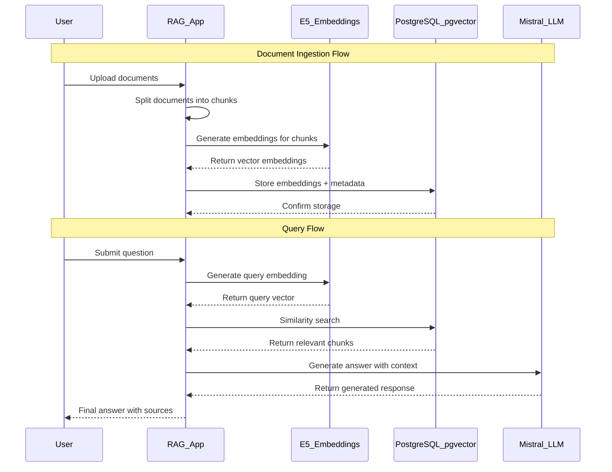

# RAG-система с Docker Compose: PostgreSQL+pgvector, E5 Embeddings, Mistral LLM

## Обзор

Многоуровневая система Retrieval-Augmented Generation (RAG) с использованием:
- **PostgreSQL + pgvector** для хранения эмбеддингов
- **E5 (HuggingFace) embeddings** для векторизации
- **Mistral LLM** через vLLM (OpenAI-совместимый API)
- **Docker Compose** для оркестрации

## Архитектура



## Быстрый старт

1. Клонируйте репозиторий
2. Скопируйте `.env.example` в `.env` и настройте переменные
3. Запустите: `docker-compose up -d`
4. Дождитесь готовности сервисов (healthcheck)
5. Проверьте работу RAG-системы через API или CLI

## Переменные окружения

Все переменные описаны в `.env.example` с комментариями.

## Использование

- Загрузка документов: поместите файлы в `rad_project/documents/`
- Запросы: используйте API или CLI-интерфейс (см. main.py)

## Требования

- Docker, Docker Compose
- Для ускорения — GPU (опционально)

## Проблемы и решения

- **GPU не виден**: проверьте драйверы и docker-compose deploy.resources
- **Недостаточно памяти**: уменьшите batch size или используйте меньшую модель
- **Сеть между сервисами**: все сервисы в одной сети `rag-net`

## Разработка

async def simple_example():
    # Настройка
    rag = RAGSystem(
        db_connection_string=os.getenv("DB_CONNECTION_STRING"),
        collection_name="my_documents"
    )
    
    # Инициализация
    await rag.setup_database()
    rag.initialize_vector_store()
    
    # Загрузка и индексация документов
    documents = rag.load_documents("./documents")
    split_docs = rag.split_documents(documents)
    await rag.add_documents_to_vector_store(split_docs)
    
    # Настройка поиска и QA
    rag.create_retriever(k=3)
    rag.create_qa_chain()
    
    # Запрос
    result = await rag.query("Что такое искусственный интеллект?")
    print(result["answer"])

if __name__ == "__main__":
    asyncio.run(simple_example())
```

### 2. Расширенный пример с кастомизацией

```python
async def advanced_example():
    rag = RAGSystem(
        db_connection_string=os.getenv("DB_CONNECTION_STRING"),
        collection_name="advanced_kb",
        embedding_model="text-embedding-ada-002",
        llm_model="gpt-4"
    )
    
    # Кастомный промпт
    custom_prompt = """
    Ты эксперт в области искусственного интеллекта. 
    Используй контекст для предоставления детального технического ответа.
    
    Контекст: {context}
    Вопрос: {question}
    
    Технический ответ с примерами:
    """
    
    # Инициализация с кастомными параметрами
    await rag.setup_database()
    rag.initialize_vector_store()
    
    documents = rag.load_documents(
        "./documents", 
        file_extensions=[".txt", ".md", ".pdf"]
    )
    
    # Меньшие чанки для лучшей точности
    split_docs = rag.split_documents(
        documents, 
        chunk_size=500, 
        chunk_overlap=50
    )
    
    await rag.add_documents_to_vector_store(split_docs)
    
    # Поиск с порогом релевантности
    rag.create_retriever(
        search_type="similarity_score_threshold",
        k=5,
        score_threshold=0.8
    )
    
    rag.create_qa_chain(custom_prompt)
    
    # Множественные запросы
    questions = [
        "Объясни принципы работы трансформеров",
        "Какие есть методы регуляризации в нейронных сетях?",
        "Как происходит backpropagation?"
    ]
    
    for q in questions:
        result = await rag.query(q)
        print(f"Q: {q}")
        print(f"A: {result['answer']}\n")
```

## Оптимизация производительности

### 1. Индексы для PostgreSQL

```sql
-- Создание индекса для векторного поиска
CREATE INDEX ON langchain_pg_embedding USING ivfflat (embedding vector_cosine_ops) WITH (lists = 100);

-- Создание индекса для метаданных
CREATE INDEX ON langchain_pg_embedding USING gin (cmetadata);
```

### 2. Пул соединений

```python
import asyncpg
from langchain.vectorstores.pgvector import PGVector

class OptimizedRAGSystem(RAGSystem):
    def __init__(self, *args, **kwargs):
        super().__init__(*args, **kwargs)
        self.pool = None
    
    async def create_pool(self):
        self.pool = await asyncpg.create_pool(
            self.db_connection_string,
            min_size=5,
            max_size=20
        )
    
    async def close_pool(self):
        if self.pool:
            await self.pool.close()
```

### 3. Кеширование

```python
from functools import lru_cache
import hashlib

class CachedRAGSystem(RAGSystem):
    def __init__(self, *args, **kwargs):
        super().__init__(*args, **kwargs)
        self.query_cache = {}
    
    def _get_cache_key(self, query: str) -> str:
        return hashlib.md5(query.encode()).hexdigest()
    
    async def query(self, question: str, use_cache: bool = True) -> dict:
        if use_cache:
            cache_key = self._get_cache_key(question)
            if cache_key in self.query_cache:
                return self.query_cache[cache_key]
        
        result = await super().query(question)
        
        if use_cache:
            self.query_cache[cache_key] = result
        
        return result
```

## Мониторинг и отладка

### 1. Логирование

```python
import logging

# Настройка детального логирования
logging.basicConfig(
    level=logging.DEBUG,
    format='%(asctime)s - %(name)s - %(levelname)s - %(message)s',
    handlers=[
        logging.FileHandler('rag.log'),
        logging.StreamHandler()
    ]
)

# Включение логирования LangChain
logging.getLogger("langchain").setLevel(logging.DEBUG)
```

### 2. Метрики

```python
import time
from dataclasses import dataclass

@dataclass
class QueryMetrics:
    query: str
    response_time: float
    retrieved_docs: int
    answer_length: int
    
class MetricsCollector:
    def __init__(self):
        self.metrics = []
    
    async def query_with_metrics(self, rag: RAGSystem, question: str):
        start_time = time.time()
        result = await rag.query(question)
        end_time = time.time()
        
        metrics = QueryMetrics(
            query=question,
            response_time=end_time - start_time,
            retrieved_docs=len(result.get('sources', [])),
            answer_length=len(result['answer'])
        )
        
        self.metrics.append(metrics)
        return result
```

## Troubleshooting

### Частые проблемы:

1. **Ошибка подключения к PostgreSQL**
   ```bash
   # Проверка статуса PostgreSQL
   sudo systemctl status postgresql
   
   # Перезапуск сервиса
   sudo systemctl restart postgresql
   ```

2. **Ошибка "relation does not exist"**
   ```sql
   -- Проверка существования таблиц
   \dt
   
   -- Пересоздание векторного хранилища
   DROP TABLE IF EXISTS langchain_pg_embedding CASCADE;
   DROP TABLE IF EXISTS langchain_pg_collection CASCADE;
   ```

3. **Проблемы с памятью при больших документах**
   ```python
   # Уменьшите размер батча
   batch_size = 10  # вместо 50
   
   # Увеличьте chunk_size для меньшего количества чанков
   chunk_size = 2000
   ```

4. **Медленные запросы**
   ```sql
   -- Создание дополнительных индексов
   CREATE INDEX CONCURRENTLY idx_embedding_collection 
   ON langchain_pg_embedding(collection_id);
   
   -- Анализ запросов
   EXPLAIN ANALYZE SELECT * FROM langchain_pg_embedding LIMIT 10;
   ```